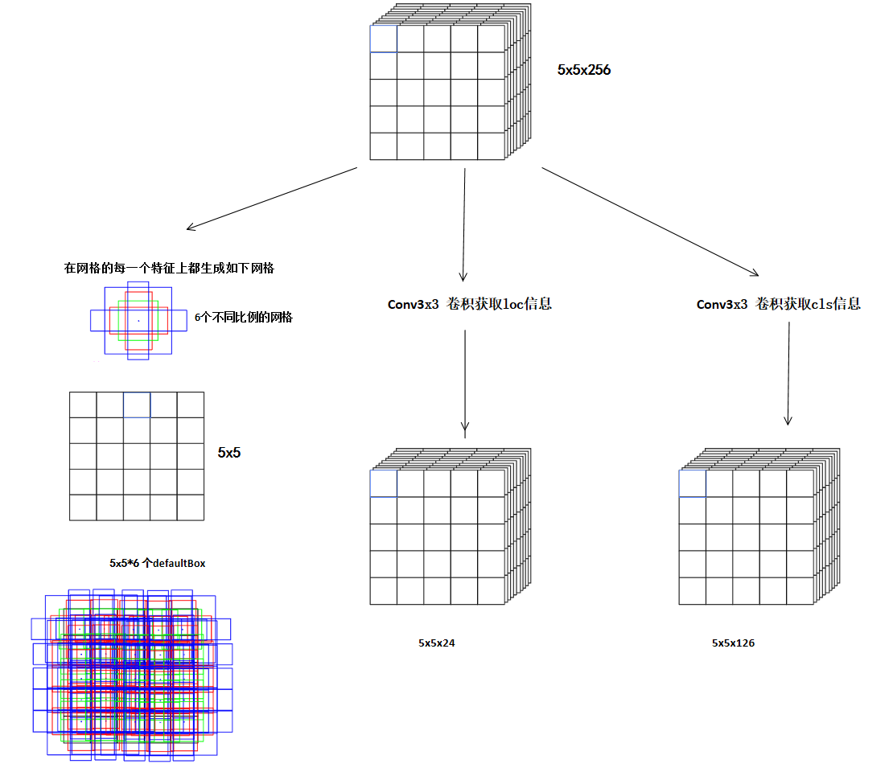

SSD300模型

# 1、SSD网络结构
SSD以VGG16作为特征提取特征的基础模型，然后在VGG16的基础上增加了额外的卷积和池化操作来获得更多不同尺度的特征图用来检测不同大小的目标
本文主要是SSD300作为例子进行分析

整体主要分为3个部分
-	backbone网络：VGG16
-	Extra网络：用来获取更多尺度的特征图
-	loc和cls网络：用来预测物体的位置信息和分类信息

## 1.1 backbone网络
backbone以VGG15作为基础模型，并对此进行稍微的改动


**空洞卷积的好处**
扩大感受野，且不丢失分辨率：在deep net中为了增加感受野且降低计算量，总要进行降采样(pooling或s2/conv)，这样虽然可以增加感受野，但空间分辨率降低了。为了能不丢失分辨率（即可以不改变图像输出特征图的尺寸），且仍然扩大感受野，可以使用空洞卷积。这在检测，分割任务中十分有用。一方面感受野大了可以检测分割大目标，另一方面分辨率高了可以精确定位目标。
捕获多尺度上下文信息：空洞卷积有一个参数可以设置dilation rate，具体含义就是在卷积核中填充dilation rate-1个0，因此，当设置不同dilation rate时，感受野就会不一样，也即获取了多尺度信息。当然这样的操作不影响特征图的尺寸，又避免下采样造成信息损失，同时也利用到多尺度信息。
知识补充：我们知道,神经元感受野的值越大表示其能接触到的原始图像范围就越大，也意味着它可能蕴含更为全局，语义层次更高的特征；相反，值越小则表示其所包含的特征越趋向局部和细节。因此感受野的值可以用来大致判断每一层的抽象层次。
**潜在问题** ：远距离获取的信息没有相关性：由于空洞卷积稀疏的采样输入信号，使得远距离卷积得到的信息之间没有相关性，影响分类结果。
**代码实现**
```python
import torch.nn as nn
from torch.hub import load_state_dict_from_url

# 300,300,3 -->
# 300,300,64 --> 300,300,64 --> 150,150,64 -->
# 150,150,128 --> 150,150,128 --> 75,75,128 -->
# 75,75,256 --> 75,75,256 --> 75,75,256 --> 38,38,256 -->
# 38,38,512 --> 38,38,512 --> 38,38,512 --> 19,19,512 -->
# 19,19,512 --> 19,19,512 --> 19,19,512 --> VGG 结束

# pook5 19,19,512 --> 19,19,512
# conv6 19,19,512 --> 19,19,1024
# conv7 19,19,1024 --> 19,19,1024

# 38,38,512 在第22 层
# 19,19,1024 在第34 层

base = [64, 64, 'M', 128, 128, 'M', 256, 256, 256, 'C', 512, 512, 512, 'M', 512, 512, 512]


def vgg(pretrained=False):
    layers = []
    in_channels = 3

    for v in base:
        if v == 'M':
            layers += [nn.MaxPool2d(kernel_size=2, stride=2)]
        elif v == 'C':
            layers+=[nn.MaxPool2d(kernel_size=2, stride=2, ceil_mode=True)]
        else:
            conv = nn.Conv2d(in_channels=in_channels, out_channels=v, kernel_size=3, padding=1)
            relu = nn.ReLU(inplace=True)
            layers += [conv, relu]
            in_channels = v

    pool5 = nn.MaxPool2d(kernel_size=3, stride=1, padding=1)
    conv6 = nn.Conv2d(512, 1024, kernel_size=3, padding=6, dilation=6)
    conv7 = nn.Conv2d(1024, 1024, kernel_size=1)
    layers += [pool5, conv6,
               nn.ReLU(inplace=True), conv7, nn.ReLU(inplace=True)]
    model = nn.ModuleList(layers)

    if pretrained:
        state_dict = load_state_dict_from_url("https://download.pytorch.org/models/vgg16-397923af.pth",model_dir="./model_data")
        state_dict = {k.replace('features.', ''): v for k, v in state_dict.items()}
        model.load_state_dict(state_dict, strict=False)

    return model


if __name__ == "__main__":
    net = vgg()
    for i, layer in enumerate(net):
        print(i, layer)
```
## 1.2 extra部分
为了进行后续多尺度的特征提取，在vgg16的后面又增加了额外的卷积层，如下所示：

这里卷积网络Conv8-2、Conv9-2、Conv10-2、Conv11-2 得到的特征图都会被输入到后续的目标检测，用于位置的回归和分类的计算

综合vgg16网络 这里将 Conv4-3、Conv7 和 extra网络的 Conv8-2、Conv9-2、Conv10-2、Conv11-2 作为不同尺度的特征层，其输出分别是[512,38,38]、[1024,19,19]、[512,10,10]、[256,5,5]、[256,3,3]、[256,1,1],将他们分别送给loc和cls网络进行目标检测，从而实现多尺度的目标检测任务。

## 1.3 loc和cls
在backbone 网络和extras 的特征提取网络上提取出来的6个特征图上进行位置和分类信息的提取。

-	左侧分支负责在每一个特征网格上生成对应数量的defaultBox
-	中间分支是对特征层的数据进行3X3卷积，生成坐标位置信息 输出的特征图尺寸为5x5x24 （其中24 = 4*6 是代表每个先验眶有4个坐标信息，特征图上每个单元格产生6个先验框）
-	右侧分支是负责在对应这个特征层的数据进行3X3卷积 获取类别置信度信息 输出的特征图尺寸为5x5x126（ 其中126 = 21*6 ，21 是VOC数据集的20分类+背景分类，特征层每个单元格有6个先验框）

最后经过修正边界，分类和NMS过滤就得到最终的预测结果
过程如下：


其中匹配上的预测框 (cx,cy,dw,dh)分别是网络输出的回归偏移量，并非最终的坐标，需要进行转换后才能转为坐标值
具体转换关系见2.2.2小结中 通过网络预测的结果 求出 $d^{cx}$、$d^{cy}$ $d^{w}$、$d^{h}$

### 1.3.1 Default Box层先验框的生成方法
SSD 一共有6个不同尺度的特征图，不同特征图上设置的先验框的数量、尺度、宽高都是不一样的。

先验框的尺度遵守一个线性递增规则：从 Conv4-3、Conv7 、Conv8-2、Conv9-2、Conv10-2、Conv11-2 能检测的物体尺度越来越大，那么对应的先验框尺度也跟着增大。

假设使用的特征图个数为 m ，$S_k$  表示第k个特征图中default_box的尺度,论文中给出尺度的计算公式，这里理论和实践略有不同


其中 $S_{max}= 0.9$  $S_{min}= 0.2$  。

在具体的实验中，SSD300 将 Conv4_3 的特征图尺寸设置为了 0.1，从Conv7开始计算$S_{min}=0.2$

有了上述公式就可以计算出每一个特征图defaultBox的尺寸。

```
feature_layer = [conv4_3, conv7, conv8_2, conv9_2, conv10_2, conv11_2] 

feature_shape = [(38,38), (19,19), (10,10), (5,5), (3,3), (1,1)]
```

| **layer** | $S_k$                     | min scale($\frac{0.7}{4}\approx0.17$) | max scale |
| --------- | ------------------------- | ------------------------------------- | --------- |
| conv4_3   | 0.1                       | 30                                    | 60        |
| conv7     | 0.2                       | 60                                    | 111       |
| conv8_2   | $0.2+\frac{0.7}{4} ×1=0.37$ | 111                                   | 162       |
| conv9_2   | $0.2+\frac{0.7}{4} ×2=0.54$ | 162                                   | 213       |
| conv10_2  | $0.2+\frac{0.7}{4} ×3=0.71$ | 213                                   | 264       |
| conv11_2  | $0.2+\frac{0.7}{4} ×4=0.88$ | 264                                   | 315       |

然后这个 315 是怎么得来的，可以拿公式算出来，$315 = 300\times[0.2+\frac{0.7}{4}\times5]$，个人理解可能是需要圈出最大的物体，覆盖整个图片

### 1.3.2 default boxes 的宽高比

对 default boxes 设置了不同的宽高比，记为 $a_r ∈ [{ 1 , 2 , 3 , \frac{1}{2} , \frac{1}{3}}]$，对每个 default box，宽和高分别由以下公式来计算：
$$
w_k^a=s_k\sqrt{a_r}, h_k^a= \frac{s_k}{\sqrt{a_r}}
$$
此外如果是对于长宽比为1时，我们还为其添加一个默认边界框，尺度为$s^{'}_k=\sqrt {s_ks_{k+1}}$,这样理论上每个特征位置都有6个default boxes。但是在实际中并非这样

- 对于conv4_3、conv10_2, conv11_2 他们的每个特征点边界框个数是4个。
- 对于 conv7，conv8_2，conv9_2 的特征图，他们的每个特征点处设置边界框个数是6个。

| **layer** | 特征图宽高   | 默认框尺寸                                                   | 默认框数量 |
| --------- | ------------ | ------------------------------------------------------------ | ---------- |
| conv4_3   | $38\times38$ | $30\{1,2,1/2\} + \sqrt{30*60}$                               | 4          |
| conv7     | $19\times19$ | $60\{1,2,1/2\} + \sqrt{60*111}$                              | 4          |
| conv8_2   | $10\times10$ | $111\{ 1 , 2 , 3 , \frac{1}{2} , \frac{1}{3}\} + \sqrt{111*162}$ | 6          |
| conv9_2   | $5\times5$   | $162\{ 1 , 2 , 3 , \frac{1}{2} , \frac{1}{3}\} + \sqrt{162*213}$ | 6          |
| conv10_2  | $3\times3$   | $213\{ 1 , 2 , 3 , \frac{1}{2} , \frac{1}{3}\} + \sqrt{213*264}$ | 6          |
| conv11_2  | $1\times1$   | $264\{ 1 , 2 , \frac{1}{2}\} + \sqrt{264*315}$               | 4          |

### 1.3.3 default boxes 的中心

还是拿5*5的特征图举例：


这个特征图的中心点就在 x = [30、90、150、210、270]  y = [30、90、150、210、270] 

将两者进行 meshgrid 操作就得到了该特征图的中心点。有了这些中心点，那么在中心点的基础上去计算这个中心点对应的不同比例的 default boxes 的宽高就容易了。

## 2 模型训练

### 2.1 正负样本标记

在训练过程中，首页要 明确训练图中的ground truth 与哪一个先验框进行匹配，只有与之匹配上的先验框才负责进行物体的检测。

default boxes 和 ground truth 匹配原则

- 正样本：

  1、对于图片中的ground truth 去和 每一个该层的先验框进行 iou匹配，找到与其IOU最大的先验框，保证与某一先验框匹配上。
  2、对于剩余的未匹配的先验框，如果先验框和 GT 的IOU大于某一个阈值（一般0.5），那么这个先验框和GT也算作匹配。

- 负样本

  除了正样本之外的都算作负样本，但是一般情况负样本数量远超正样本，为了解决正负样本训练不平衡问题，SSD 采用`hard negative mining`策略,也就是说在训练过程中不拿所有的负样本进行训练，而是将负样本进行抽样，抽样时按照置信度误差进行降序排列，选取误差较大的top-k个负样本作为训练负样本，保证正负样本的比例接近1:3。这样在计算损失时候有用。

		负样本的置信度损失越大，那么网络就会将该负样本预测为包含目标的概率越大，所以它属于困难样本，故使用这些困难样本来训练网络的效果更好

注意：

1、某个GT可以和多个先验框匹配，而每个先验框只能和一个GT进行匹配

2、如果多个GT和某一个先验框的IOU均大于阈值，那么先验框只与IOU最大的那个进行匹配

### 2.2 损失函数

首先明确SSD 的损失包含两部分

1、类别损失

2、定位损失


其中类别损失可以写为


**2.2.1 类别损失**

正样本这里：

这里$\widehat{c}_i^p$ 代表的是第i个default box 对应GT box的 多分类的概率，也就是网络预测的结果 在20分类的得分经过Softmax后的概率（VOC2007数据集）

$x_{ij}^p$ 就是代表第i个default box 和 第j 个类别为p的 GT box匹配上之后 它就是1 ，如果没有匹配上就是0

参考代码：

```python
def _class_loss(self, y_true, y_pred):
    y_true = torch.clamp(y_true, min=1e-7)
    softmax_loss = -torch.sum(y_true * torch.log(y_pred), -1)
    return softmax_loss
```

可以看到y_true 是一个已经经过one_hot编码的类别 tensor,y_pred 是网络预测的得分经过softmax分类之后的结果，这两个对应位置相乘，如果y_pred 匹配上了GT的one_hot编码值，那么值就很大，取反之后loss值就很小了。

负样本这里：

表示网络预测第 i 个 default box 为背景的概率，在实际代码里这块

```python
neg_conf_loss = torch.gather(classes_loss.view([-1]), 0, indices)
```

预测背景概率越高，损失越小。indices 代表的是选取的top-k的（负样本）难分类样本的索引下标。

**2.2.2 定位损失**

首先定位损失只针对正样本，因为负样本没有GTbox

位置损失采用了 $smooth_{L1} $ loss，该损失的计算要回归至 default bounding box (简记为 d) 的中心 ( c x , c y )及宽度(w )和高度(h )的偏移量。公式如下：


- 其中$x_{ij}^k$ 表示第i个预测框与第j个真实框的类别是k是否匹配：0,1

- $l_{i}^m$ 调整的预测框i

- ${}$$\widehat{g}_j^m$ 第j个真实框

  的中心、宽、高

  调整后的第i个预测框相对于第j个gt box的中心、宽高分别是


SmoothL1公式：


定位损失计算参考代码：

```python
def _location_loss(self, y_true, y_pred):
    diff = torch.abs(y_true - y_pred)
    small = 0.5 * diff ** 2
    large = diff - 0.5
    l1_loss = torch.where(diff < 1, small, large)
    return torch.sum(l1_loss, -1)
```


## 3 模型预测

1、针对所有的8732个预测框取判断 在对应类别上的种类置信度 大于阈值 （0.5），并过滤掉背景

2、对第一步中 留下来的预测结果进行解码，计算出解码后的预测框的信息（解码后一般还需要做clip，防止预测框位置超出图片）

3、解码之后，进行NMS算法，过滤掉那些重叠度较大的预测框

4、取出非极大值抑制比较好的内容进行 box、置信度、分类的堆叠，方便后期数据展示使用

